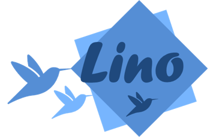

 

    

# Lino

> **Page web du projet (IFT3150):** https://ift3150-lino.netlify.app/

Lino est un projet visant à **bonifier l'initiative des boîtes à livres et encadrer les activités littéraires de la communauté étudiante**.

## Objectifs 🎯

- **Faciliter le repérage des boîtes à livre**: L'application doit fournir une carte avec des mécanismes de recherche et tri facilitant le repérage des boîtes à livre.
- **Assurer les échanges et la recherche de livre**: L'application doit permettre aux étudiants de soumettre des requêtes et notifier le réseau lors de l'ajout d'un livre.
- **Développer la structure du réseau**: L'application doit permettre aux étudiants d'exprimer leurs préférences littéraires et simplifier leur mise en relation.
- **Encadrer l'organisation d'activités littéraires**: L'application doit faciliter l'organisation et la communication d'activités et d'évènements littéraires.

## Fonctionnalités📱

### Public

- [ ] Localiser les boîtes à livres sur une carte (avec preview) `phase 1`
- [ ] Voir la liste des boites à livres à proximité `phase 1`
- [ ] Voir les livres contenus dans les boîtes à livre `phase 1`
- [ ] Voir les livres contenus dans une boîte à livre spécifique `phase 1`
- [ ] Chercher des livres disponibles dans les boîtes à livres selon différents critères et mots clés `phase 2`
- [ ] Ajouter un nouveau livre à une boîte à livre et à la base de données, générer un code QR et le coller su2 le livre `phase 2`
- [ ] Retirer un livre d'une boîte à livres en scannant son code QR `phase 2`

### Avec compte

- [ ] Créer une alerte pour les utilisateurs pour signaler qu'on souhaite avoir un livre avec un titre spécifique dans une des boîtes à livres
- [ ] Recevoir une notification quand une action est faite sur un livre qu'on suit ou qu'on a mis en favoris
- [ ] Consulter l'impact écologique total de nos transactions `phase 3`
- [ ] Créer des threads de discussion liés à un titre de livre en particulier `phase 2`
- [ ] Envoyer et répondre à des messages dans des threads `phase 2`
- [ ] Réagir à des messages `phase 2`

## 📅 Échéancier

> Début du projet: 6 mai 2024  
> Fin du projet: 16 aout 2024

Le développement du projet sera divisé en plusieurs phases:

### Phase 1: Élaboration des exigences

- Semaine 1
- Semaine 2

### Phase 2: Prototypage et conception

- Semaine 3
- Semaine 4
- Semaine 5
- Semaine 6

### Phase 3: Développement 

- Semaine 7
- Semaine 8
- Semaine 9
- Semaine 10
- Semaine 11
- Semaine 12

### Phase 4: Tests & Rapports

- Semaine 13
- Semaine 14
- Semaine 15
- Semaine 16

Le suivi du projet est présenté dans le fichier [**TIMELINE**](TIMELINE.md).

## 🌐 Infrastructure

L'infrastructure de l'application est basée sur...

<!-- TODO -->

# 📘 Documentation

<!-- - Dossier Drive: Contient la documentation du projet -->
- [Wiki](https://github.com/ceduni/lino/wiki): Contient la documentation de l'application et de l'infrastructure développée (Services, API, Base de données...)

# 🗂️ Organisation

Les documents associés au projet se trouvent dans le 
Les dossiers du répertoire sont organisés comme suit:

<!-- TODO -->

# 🌟 Contribution

Si vous êtes intéressé à participer au projet, contactez [Louis-Edouard LAFONTANT](mailto:louis.edouard.lafontant@umontreal.ca).

## Contributeurs

- Hoang Quan Tran [@benhoangquan](https://github.com/benhoangquan)
- Oscar Lavolet [@Gelehead](https://github.com/Gelehead)
- Nathan Riantsoa Razafindrakoto [@NathanRazaf](https://github.com/NathanRazaf)
- Jalal Fatouaki [@jalalfatouakii](https://github.com/jalalfatouakii)
